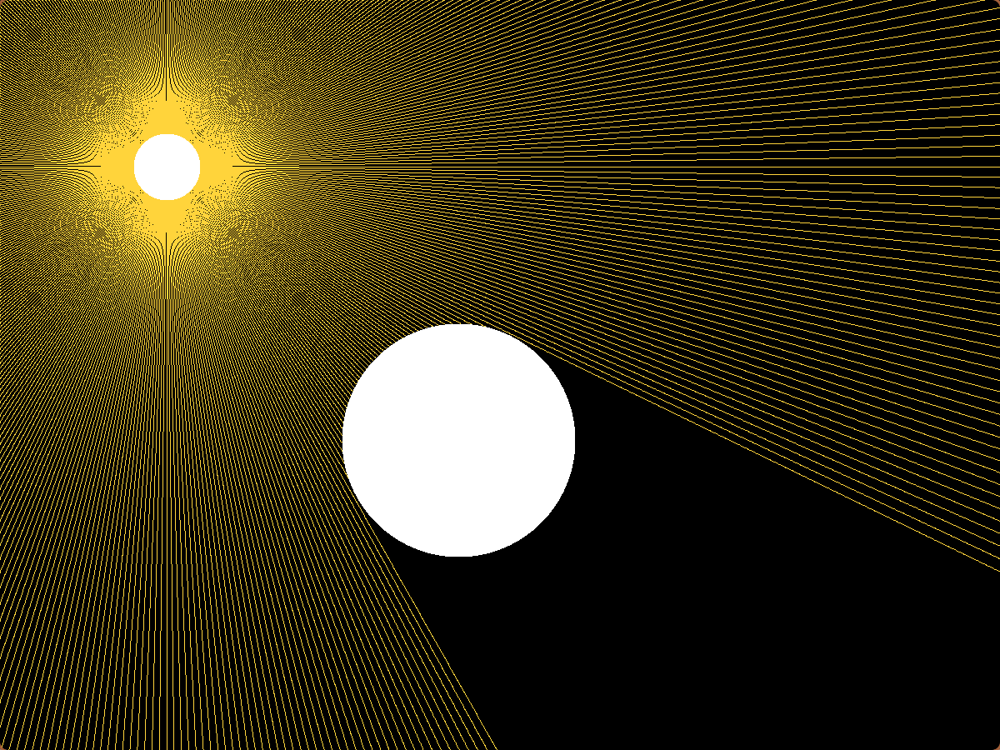

This is a simple raytracing application made in C with SDL2. 

To compile and run the program:
* You MUST have [SDL2](https://wiki.libsdl.org/SDL2/Installation) installed
* make the build directory | mkdir build
* change to the build directory | cd build
* run the cmake | cmake ..
* run make | make
* run the program | ./raytracing

The larger circle, referred to as the shadow obstacle, will move up and down the screen to show the changing rays from the light source. If you left click and move the mouse, you can move the light source around the screen to see how that effects the rays. The rays are cast from the center point of the light source circle, so if that point is covered either by the obstacle or the border of the window, no rays will be cast. 

